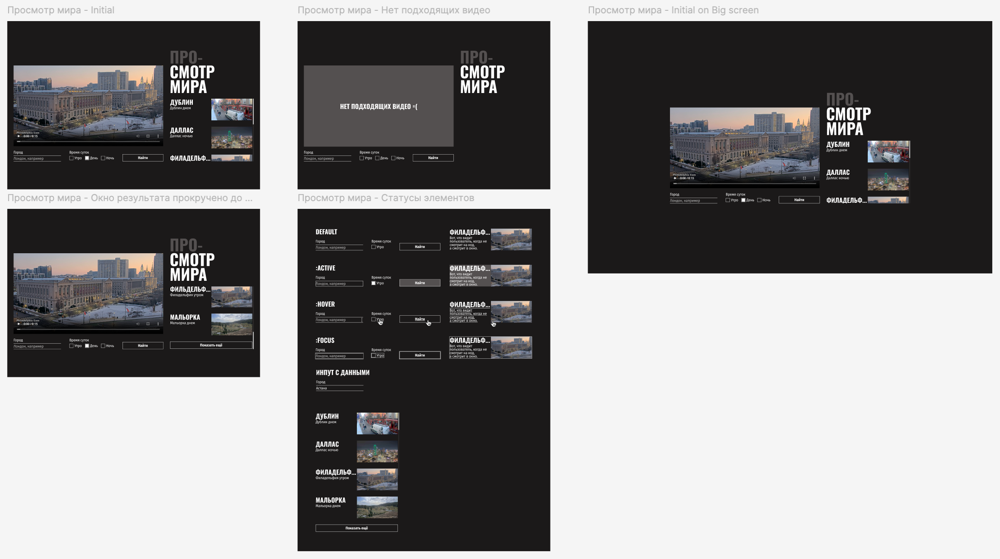
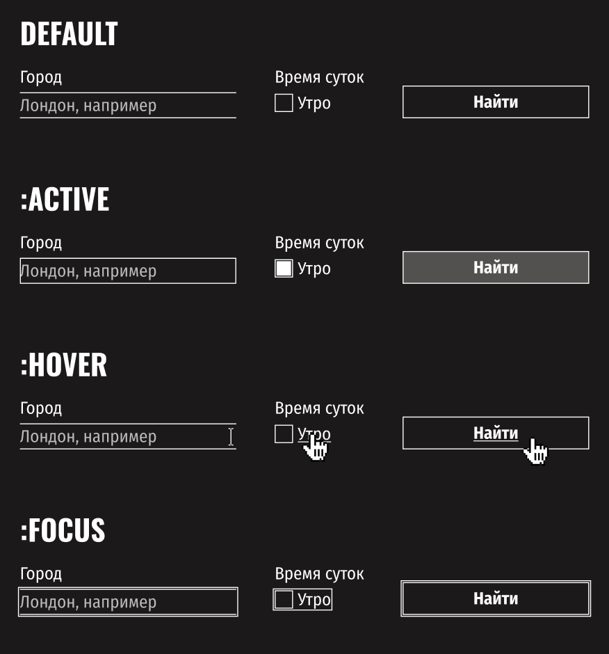
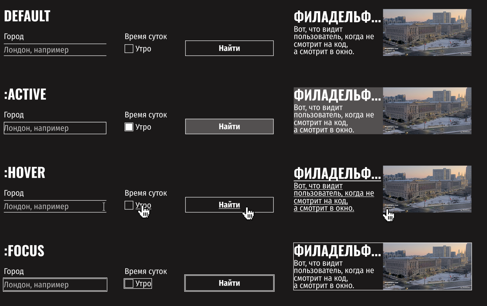

# Проектная работа

В этой проектной работе вам предстоит написать CSS для уже работающего приложения «Просмотр мира». Вы дополните
файл `style.css` так, чтобы интерфейс соответствовал макету проекта.



[Шаблон проекта](https://github.com/practicetasks/prosmotr-mira)

## Шаг 0. Предварительная подготовка

Изучите макет
проекта [«Просмотр мира»](https://www.figma.com/design/2fx58LwuKbnB6Z5VZQU7Nn/%D0%9F%D1%80%D0%BE%D1%81%D0%BC%D0%BE%D1%82%D1%80-%D0%BC%D0%B8%D1%80%D0%B0?node-id=0-1&p=f&t=ysNTyKQYIn8C5mFQ-0).

В стартовом репозитории вы получите готовые файлы:

- всю HTML-разметку;
- CSS для компонентов прелоадера, кастомного скроллбара и вывода ошибки;
- файлы шрифтов и стили для них;
- файл со скриптом, в котором описана логика работы приложения.

Открыв страницу из заготовки, вы увидите подгруженные видео и даже сможете выполнить поиск.

### Описание функциональности приложения

- При загрузке страницы скрипт получает данные из внешнего источника, отрисовывает пять карточек с видео и кнопку, чтобы
  подгрузить дополнительные карточки. Ещё он подставляет адрес первого из загруженных роликов в тег `<video>` внутри
  крупного блока на странице.
- Скрипт отслеживает клик по карточкам и меняет текущее видео в зависимости от выбранной карточки.
- Также скрипт следит за отправкой формы. После отправки он ищет в базе данных совпадения по введённым параметрам и
  перерисовывает страницу с данными, полученными из нового запроса.
- В случае ошибок на место блока с видео подставляется блок с сообщением об ошибке. А пока идёт поиск, в блоки с видео и
  карточками подставляются прелоадеры, отображающие анимацию процесса загрузки.

При работе над вёрсткой вам нужно сохранить эту функциональность. Поэтому постарайтесь минимизировать свои действия с
HTML-кодом, сейчас его достаточно, чтобы реализовать задачу. Не меняйте заданные имена классов.

### Устройство HTML-кода

Изучите код в файле `index.html`. В нём есть кое-что новое — теги `<template>`. Это шаблоны для разметки, которая
появится на странице только по запросу. Они нужны для разработки на JavaScript и создания интерактивности. Эти теги
собраны в
одном месте — в конце тега `<body>`.

При загрузке страницы браузер не отрисовывает содержимое тегов <template>, но он знает об их существовании. В нужный
момент программист может:

1. Создать сколько угодно экземпляров разметки из этого тега на JavaScript.
2. Подставить в эту разметку любые значения текста и атрибутов.
3. Вставить полученный экземпляр разметки в нужную часть страницы.

В коде четыре таких шаблона:

- Шаблон пункта списка с карточкой видео — в него подставляются данные для создания нужного количества карточек.
- Шаблон прелоадера — пока данные загружаются, для зон, где будет контент, создаются экземпляры прелоадера. Когда
  контент готов, прелоадеры убираются.
- Шаблон кнопки «Показать ещё» — кнопка ставится в конец списка карточек каждый раз, когда доступны дополнительные
  видео. Нажатие на кнопку подгружает пять дополнительных карточек.
- Шаблон блока с ошибкой — вставляется на страницу при возникновении ошибки, текст на шаблоне зависит от типа ошибки.

Важно понимать, что стилизация экземпляров, которые созданы из шаблонов, не отличается от стилизации любых
HTML-элементов. Вы всё так же можете использовать селекторы для элементов, которые описаны внутри шаблонов, и писать для
них CSS-правила, — они применятся к экземплярам.

Вот пример:

```html
<template class="more-button-template">
  <button class="button more-button">Показать еще</button>
</template>
```

Для такой конструкции в HTML сработает следующий CSS:

```css
.more-button {
    background-color: transparent;
}
```

Он применится к любой из кнопок «Показать ещё» на странице.

## Шаг 1. Лейаут

В файле `style.css` уже есть часть базовых стилей. Они сбрасывают отступы и некоторые браузерные стили и добавляют
минимальный набор стартовых правил.

Первым делом попробуйте собрать общий лейаут страницы. Сделайте так, чтобы взаимное расположение больших секций сайта
примерно соответствовало макету. Этого можно добиться разными способами, но здесь лучше использовать гриды.

1. Задайте флекс для верхнего контейнера `.page`.
2. Задайте грид для `.content` и пропишите `grid-area` для всех элементов внутри.

Задачи, которые вам предстоит для этого решить:

1. Расположить блок `.content` посередине `.page`.
2. Расположить элементы `.content` в строку, прижав к низу вертикальной оси.
3. Задать горизонтальные размеры `.content` и отступы между его элементами.
4. Расположить элементы `.search-form` в строку, пропорционально распределить между ними свободное пространство и
   прижать
   их к началу контейнера.
5. Установить вертикальный размер для `.content__list-container` и добавить скролл при переполнении. Скроллбар (полоса
   прокрутки) скрывать не нужно, он уже стилизован в соответствии с макетом.
6. Растянуть `.content__details` на всю доступную ширину и высоту контейнера и добавить отступы между заголовком и зоной
   с
   карточками.

## Шаг 2. Уточнение размеров

Подгоните ряд элементов под размеры, чтобы страница стала похожа на макет. Это позволит детальнее прорабатывать
компоненты уже в близком к готовности лейауте.

Выполните следующие шаги:

1. Задайте размеры контейнеру `.result__video-container` и добавьте отступ снизу.
2. Поместите видео в этот контейнер так, чтобы оно занимало всю ширину и высоту и не выходило за пределы. Используйте
   `object-fit`.
3. Создайте вертикальные отступы между элементами `.content__list-item`. Используйте свойство `gap`.
4. Расположите элементы внутри контейнера `.content__video-card` в строку, прижав к началу контейнера по дополнительной
   оси.
5. Задайте размеры `.content__video-card-thumbnail` и расположите в них изображение так, чтобы оно закрывало весь
   элемент
   и было выровнено по центру. Используйте `object-fit` и `object-position`.
6. Сделайте так, чтобы `.content__video-card-description-container` занимал всё доступное пространство (не занятое
   картинкой). Вам поможет свойство `flex-grow`.

## Шаг 3. Стили текстов

Задайте текстовым элементам стили в соответствии с макетом. Сейчас для всего сайта заданы глобальные настройки шрифта,
но для некоторых элементов они должны отличаться.

Сделайте следующее:

1. Оформите текст элементов `.search-form__fieldset-title`. Обратите внимание на вес шрифта, размер, отступы.
2. Оформите элемент `.title` и вложенный в него `.content__accent`.
3. Уберите дефолтное подчёркивание и заменить цвет текста у ссылки `.content__card-link`.
4. Оформите текст `.content__video-card-title` и учтите возможность переполнения, заменяя излишний текст на “…”.
5. Обратите внимание на значение `line-height` для `.content__video-card-description` в макете. Здесь тоже нужно учесть
   возможность переполнения, для этого воспользуйтесь свойством `line-clamp`.

Обращайте особое внимание на интерлиньяж. Отчасти из-за необычного использования высоты линии макет приобретает
задуманную дизайнером брутальность.

## Шаг 4. Стилизуем формы и их состояния

Для работы с элементами формы понадобится паттерн `.visually-hidden`. С его помощью вам нужно скрыть лишние лейблы и
браузерные чекбоксы, чтобы потом нарисовать поверх них свои.

Добавьте в ваш код класс `.visually-hidden`. В HTML он уже добавлен необходимым элементам. Остались стили. Вот они:

```css
.visually-hidden {
    position: absolute;
    inline-size: 1px;
    block-size: 1px;
    overflow: hidden;
    clip: rect(0 0 0 0);
    clip-path: inset(50%);
    white-space: nowrap;
}
```

Самостоятельно сверстать кастомные элементы форм — важная часть этой проектной работы.

На этом этапе не верстайте состояния инпута и чекбоксов. Отложите это до следующего шага. Пусть чекбоксы пока не
нажимаются.

Выполните следующие шаги:

1. Создайте с помощью флексбокса строку с двумя элементами — `fieldset` и кнопкой.
2. Расположите чекбоксы в линию с помощью обёртки `.search-form__checkbox-list`. Используйте `display: flex;` и `gap`.
3. Сбросьте `border` у `fieldset`.

#### Стилизуем левый `input`

1. Задайте `.search-form__label` у инпутов для поиска городов и времени суток.
2. Расставьте элементы внутри `.search-form__label` в линию. Примените свойство `display: flex;`. Также вам пригодится
   правило `width: fit-content;`.

#### Стилизуем текстовое поле ввода

При вёрстке текстового поля обращайте внимание на размеры, границу, цвет текста, семейство и размер шрифта, фон.
Некоторые из этих свойств не наследуются. Стилизуйте input (текстовое поле ввода):

1. Задайте стиль текстовому полю.
2. Оставьте `border` сверху и снизу.
3. Установите цвет шрифта и фона согласно макету.
4. Текстовому задайте свойство `appearance: none;`. Так в разных браузерах будут нужные вам стили.

#### Стилизуем чекбокс

1. Добавьте стиль для псевдочекбокса. Задайте стиль для `border` и выровняйте по центру. Обёртка
   `.search-form__checkbox-list` создана специально для того, чтобы выстроить чекбоксы в линию.
2. Добавьте псевдоэлемент `::after`. Белый фон, размер задан, как у чек-бокса. Когда будете стилизовать
   `.search-form__pseudo-checkbox`, учитывайте, что в нём появится элемент, который должен оказаться точно по центру. В
   макете внутренний квадрат включённого чек-бокса на один пиксель меньше самого чекбокса.
3. Когда чекбокс активен (псевдокласс `:checked`) — отобразите внутри псевдоэлемент, который стилизовали в `::after`.
4. Декорируйте текст — сделайте так, чтобы при наведении на чекбокс у текста появлялось подчёркивание. Обратите
   внимание, что оно должно появляться при наведении на любую точку лейбла, а не только на сам текст.

## Шаг 5. Стилизуем формы и их состояния

На странице две кнопки: одна в форме, другая в списке карточек. У них есть общие стили, но у кнопки в списке карточек
есть и собственные. Чтобы всё сделать как надо, созданы три класса: `.button`, `.search-form__submit-button` и
`.more-button`. Подумайте, какие стили должны быть в каждом из них.

1. Сделайте общий класс кнопки. Задайте границу, цвет, шрифт и прозрачный фон.
2. Пропишите индивидуальные стили для кнопок «Найти» и «Показать ещё».
3. Для кнопки «Найти» задайте положение в конце контейнера и размер.
4. Для кнопки «Показать ещё» задайте только размер — так, чтобы она растягивалась на всю ширину контейнера
5. Стилизуйте состояние кнопок. У всех кнопок на странице три состояния: `:hover`, `:active`, `:focus-visible`.
   Состояние :
   `focus` должно быть сброшено. Эти правила применяются ко всем кнопкам на странице:
    1. При наведении — текст подчёркивается.
    2. Активная кнопка — задайте цвет согласно макету.
    3. Для кнопки в фокусе — появляется обводка, заданная через `outline`.

Вот как это будет выглядеть:



## Шаг 6. Состояния карточек

Вертикальный скролл в блоке с «окнами» скрывать не нужно. Он — часть дизайна и зафиксирован в макете.

У карточек, которые выводятся справа, тоже много состояний.

#### Стилизация карточки

1. Сделайте карточку блочным элементом.
2. Добавьте отступы между элементами.
3. Внутренне содержимое карточки расположите в строку и растяните на всё оставшееся пространство до картинки.

#### Текущая карточка

Первая карточка должна быть активной, а при переключении активная карточка должна выделяться. Это поведение уже написано
на JavaScript — при загрузке страницы скрипт добавляет класс `.content__card-link_current` первой карточке и в
дальнейшем
этот класс переходит к той карточке, на которую кликает пользователь. В CSS должны оказаться соответствующие стили для
селектора `.content__card-link_current`.

Вам нужно просто добавить фон.

#### Карточка при наведении

Декорируйте текст подчёркиванием.

#### Карточка в фокусе

У каждой карточки доступны состояния `:hover`, `:active` и `:focus-visible`. Чтобы состояние `:focus-visible` работало
корректно, придётся сбросить обводку на состоянии `:focus`. Все стили можно скопировать из макета.

Задайте `padding` слева и справа для `.content__list-item` в `3px`, так обводка не прилипнет к границе карточки если вы
будете
ее реализовывать.



## Шаг 7. Работаем с кликабельностью

Установите на кликабельные элементы `cursor: pointer`.

## Шаг 8. Позиционирование прелоадеров

Сейчас любое действие с данными вызывает преолоадеры и они перекрывают всю страницу.

Прелоадеры должны появляться в двух местах:

- поверх `.result__video-container`;
- поверх `.content__list`.

Спозиционируйте эти элементы относительно. Тогда абсолютно спозиционированные прелоадеры встанут в них.

Вот результат, который вам нужен:


